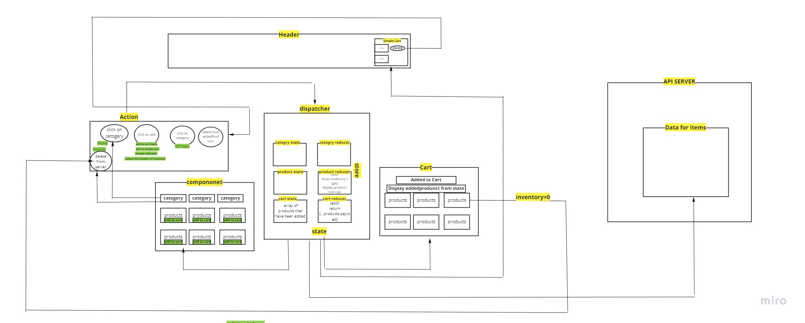

# SAFE STORE

Its an app for store called easy-story
## Available Scripts

In the project directory, you can run:

### `npm start`

### `npm test`

## UML : 

### Deployment
- netlify:  https://romantic-booth-702e1b.netlify.app/

 **The app didnt work on netlify so I chanched the githun and copy the work**
- pull request: https://github.com/HaninHaidrah/storefront/pull/6 

