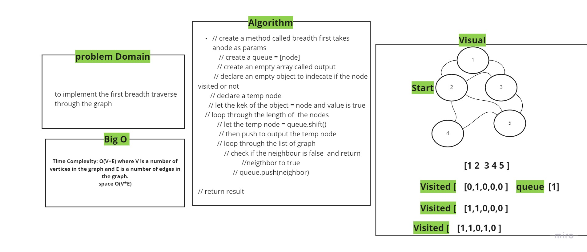

# Getting Started with Create React App

Its an app for store called easy-story
## Available Scripts

In the project directory, you can run:

### `npm start`

### `npm test`

## UML : 

### Deployment
- netlify: 
- pull request: https://github.com/HaninHaidrah/storefront/pull/1 

