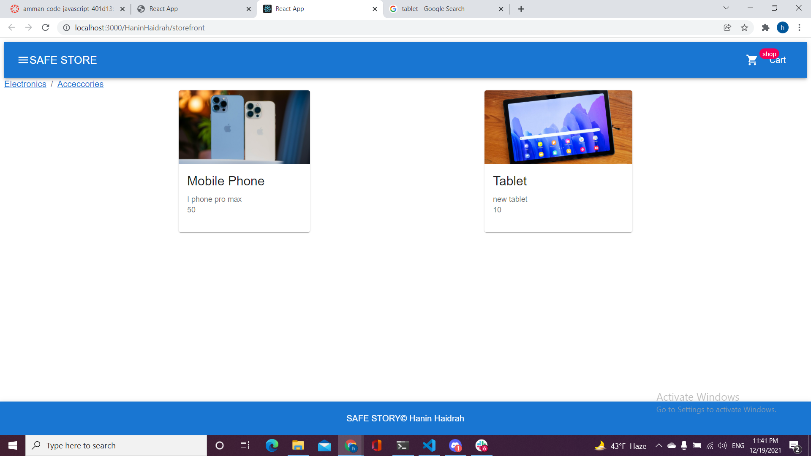

# SAFE STORE

Its an app for store called easy-story
## Available Scripts

In the project directory, you can run:

### `npm start`

### `npm test`

## UML : 

## IMG FOR app Locally (incase the deployment didnt work) => 

### Deployment
- gh-pages:  https://haninhaidrah.github.io/storefront/  
- pull request: https://github.com/HaninHaidrah/storefront/pull/1 

